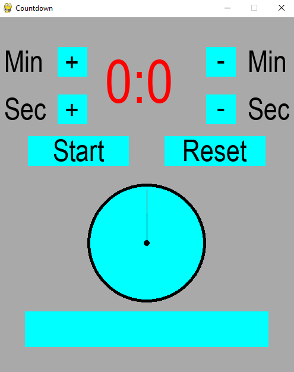

# CLOCK APPLICATION WITH PYTHON
Build a clock application with Pygame (Python).

## PREREQUISITES
<ul>
    <li>Python 3+ 
        <a href="https://www.python.org/">(Download here)</a>
    </li>
    <li>Visual Studio Code IDE
        <a href="https://code.visualstudio.com/">(Download here)</a>
    </li>
    <li>Sound samples (E.g alarm.wav, tick.wav)
        <a href="https://pixabay.com/sound-effects/search/alarm/">(Download here)</a>
    </li>
</ul>

## INSTALLATION AND SETUP
Install <i>pygame</i> library

```
pip install pygame
```

## CODING
### Import necessary libraries
```
# install pygame module
import pygame
import time
import math
```

### Start a progame with pygame module
```
pygame.init()
```

### Display a screen with size of 500x600 and a caption for this screen
```
screen = pygame.display.set_mode((500,600))
pygame.display.set_caption("Countdown")
```

### Set RGB color selector
```
AQUA = (0,255,255)
GRAY = (169,169,169)
BLACK = (0,0,0)
RED = (255,0,0)
```

### Set clock with Clock() method
```
clock = pygame.time.Clock()
```

### Create font and size
```
font = pygame.font.SysFont('sans', 50)
font1 = pygame.font.SysFont('sans', 100)
```

### Render font to each rects by specticular symbols or words(in black totally)
```
b1 = font.render('+', True, BLACK)
b2 = font.render('-', True, BLACK)
b3 = font.render('Min', True, BLACK)
b4 = font.render('Sec', True, BLACK)
b5 = font.render('Start', True, BLACK)
b6 = font.render('Reset', True, BLACK)
```

### Set variables
```
mins = 0
secs = 0
total = 0
start = False
total_secs = 0
running = True
```

### Set sound with Sound() method
```
sound1 = pygame.mixer.Sound("Clock Project/tick.wav")
sound2 = pygame.mixer.Sound("Clock Project/alarm.wav")
```

### Design the clock app
We put inside the while loop for running continuosly, includes:
<ul>
    <li>Set mouse x, y</li>
    <li>Fill the background into gray color</li>
    <li>Draw components of the app (E.g min, sec, etc.)</li>
    <li>Events that listen to users' actions</li>
</ul>

```
while running:

	# Mouse 
	mouse_x, mouse_y = pygame.mouse.get_pos()

	clock.tick(60)

	# fill the background into gray color
	screen.fill(GRAY)

	pygame.draw.rect(screen, AQUA, (100, 50, 50, 50))
	pygame.draw.rect(screen, AQUA, (100, 130, 50, 50))
	pygame.draw.rect(screen, AQUA, (350, 50, 50, 50))
	pygame.draw.rect(screen, AQUA, (350, 130, 50, 50))
	pygame.draw.rect(screen, AQUA, (50, 200, 170, 50))
	pygame.draw.rect(screen, AQUA, (280, 200, 170, 50))
	pygame.draw.rect(screen, AQUA, (45, 495, 410, 60))
	pygame.draw.rect(screen, AQUA, (50, 500, 400, 50))

	# Draw min
	screen.blit(b3, (10,45))
	screen.blit(b3, (420,45))

	# Draw sec
	screen.blit(b4, (10, 125))
	screen.blit(b4, (420, 125))

	# Draw '+'
	screen.blit(b1, (112,45)) # increase 12 points of X 
	screen.blit(b1, (112,125)) # Decrease 5 points of y

	# Draw '-'
	screen.blit(b2, (368,42)) # increase 18 points of x
	screen.blit(b2, (368,122)) # Decrease 8 points of y

	# Draw 'start'
	screen.blit(b5, (92,195))

	# Draw 'Reset'
	screen.blit(b6, (310,195))

	# Draw circle of clock
	pygame.draw.circle(screen, BLACK, (250,380), 100)
	pygame.draw.circle(screen, AQUA, (250,380), 95)
	pygame.draw.circle(screen, BLACK, (250,380), 5)

	for event in pygame.event.get():
		if event.type == pygame.QUIT:
			running = False
		if event.type == pygame.MOUSEBUTTONDOWN:
			if event.button == 1:
				if (100<mouse_x<150) and (50<mouse_y<100):
					total = total_secs
					total_secs += 60
				if (100<mouse_x<150) and (130<mouse_y<180):
					total = total_secs
					total_secs += 1
				if (350<mouse_x<400) and (50<mouse_y<100):
					total = total_secs
					total_secs -= 60
				if (350<mouse_x<400) and (130<mouse_y<180):
					total = total_secs
					total_secs -= 1
				if (50<mouse_x<220) and (200<mouse_y<250):
					start = True
					total = total_secs
				if (280<mouse_x<430) and (200<mouse_y<250):
					total_secs = 0

	# Function of "start"
	if start:
		if total_secs > 0:
			total_secs -= 1
			pygame.mixer.Sound.play(sound1)
			time.sleep(1) 
		else:
			start = False
			pygame.mixer.Sound.play(sound2)

	# mins and secs
	mins = total_secs // 60
	secs = total_secs - (mins * 60)

	# Draw current time
	text_time = font1.render(str(mins) + ':' + str(secs), True, RED)
	screen.blit(text_time, (180,50))
	
	# Draw second hand
	x_sec = 250 + 90 * math.sin(6 * secs * math.pi/180) 
	y_sec = 380 - 90 * math.cos(6 * secs * math.pi/180)
	pygame.draw.line(screen, RED, (250,380), (int(x_sec), int(y_sec)))

	# Draw minute hand
	x_min = 250 + 50 * math.sin(6 * mins * math.pi/180) 
	y_min = 380 - 50 * math.cos(6 * mins * math.pi/180)
	pygame.draw.line(screen, BLACK, (250,380), (int(x_min), int(y_min)))


	# Draw a red rect in order to decrease gradually by time
	if total != 0:
		pygame.draw.rect(screen, RED, (50, 500, int(400*(total_secs/total)), 50))

	pygame.display.flip()
```

### Quit the app
If the loop stopped, the app would be closed with quit() method
```
pygame.quit()
```

### Result



## CONCLUSION
We have created this app for some purposes:
<ul>
    <li>Pracetice Python coding skills</li>
    <li>Enrich my repository</li>
    <li>Understand some core Python library such as Pygame</li>
</ul>

## REFERENCES
[1] https://pixabay.com/sound-effects/search/alarm/

[2] https://www.python.org/